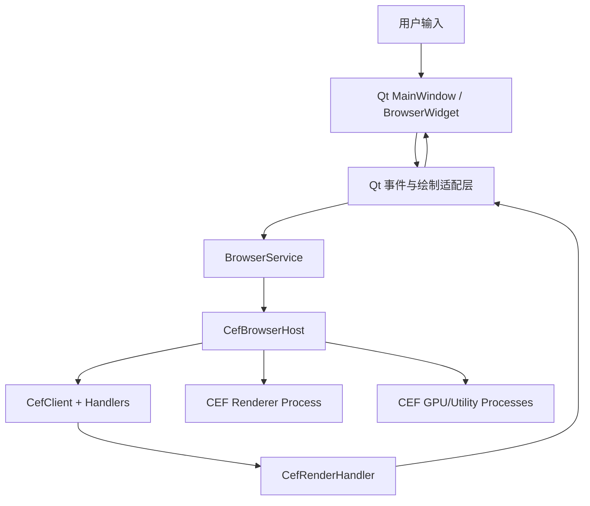
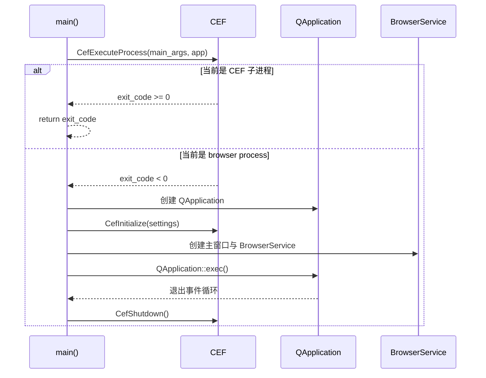
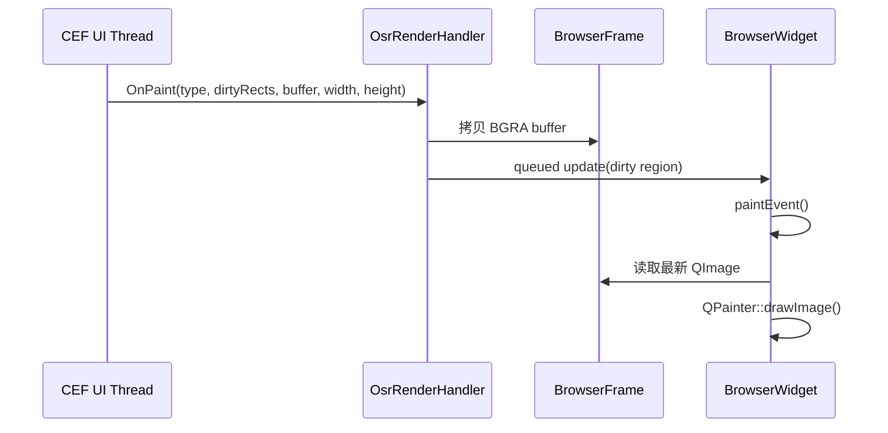
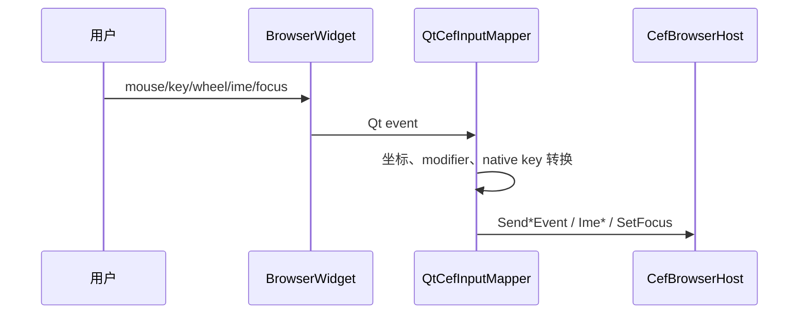

# 目标架构

本文描述 C++ + CEF + Qt Widgets 离屏渲染浏览器的目标架构。V1 主要支持 Qt 5.14.2 MSVC2017 64bit 环境，目标是稳定可用，不追求零拷贝或完整浏览器功能。

## 总体分层

## 进程模型

建议生成两个可执行文件：

| 可执行文件 | 职责 |
| --- | --- |
| `offscreen_cef_browser` | Qt 主程序，browser process，负责窗口、CEF 初始化、browser 创建和应用逻辑。 |
| `offscreen_cef_subprocess` | CEF 子进程入口，负责 renderer/gpu/utility 等 Chromium 子进程逻辑。 |

首版也可以单可执行文件运行，但单独子进程更利于控制启动成本和部署结构，也便于后续在 Windows x64（`windows64`/`win64`）、Qt 6.9.3、`win32` 和 `linux-amd64` 等 V2 候选范围上保持一致的部署形态。

版本路线：V1 只落地 Windows x64（`windows64`/`win64`）+ Qt 5.14.2 MSVC2017 64bit；V2 再根据情况评估 Qt 6.9.3、`win32` 和 `linux-amd64`。当前不考虑 macOS。

启动顺序：

## 消息循环策略

首选 external message pump：

- `CefSettings.external_message_pump = true`
- 实现 `CefBrowserProcessHandler::OnScheduleMessagePumpWork(int64_t delay_ms)`
- Qt 侧用 `QTimer::singleShot(delay_ms, ...)` 调用 `CefDoMessageLoopWork()`
- 避免直接调用 `CefRunMessageLoop()`

如果后续改用 `multi_threaded_message_loop`：

- CEF UI thread 与 Qt GUI thread 分离。
- 所有从 CEF 回调进入 Qt UI 的操作必须使用 `QMetaObject::invokeMethod(..., Qt::QueuedConnection, ...)`。
- 共享图像 buffer 必须加锁或使用不可变 frame object 交换。

## 核心模块

| 模块 | 建议类 | 职责 |
| --- | --- | --- |
| 应用入口 | `CefQtApplication` | 解析命令行、调用 `CefExecuteProcess`、初始化 CEF/Qt、退出清理。 |
| CEF App | `BrowserApp` | 实现 `CefApp`、`CefBrowserProcessHandler`、message pump 回调、命令行开关。 |
| 浏览器服务 | `BrowserService` | 创建/关闭 browser，封装导航、刷新、DevTools、下载入口。 |
| CEF Client | `BrowserClient` | 聚合 lifespan/load/display/context menu/download/render handlers。 |
| OSR Handler | `OsrRenderHandler` | 实现 `CefRenderHandler`，接收 paint/popup/IME/drag/cursor 回调。 |
| Qt Widget | `BrowserWidget` | QWidget/QOpenGLWidget，负责绘制 frame 和转发 Qt 输入事件。 |
| Frame Buffer | `BrowserFrame` | 保存当前 view/popup 图像、dirty rect、DPI、版本号。 |
| 输入转换 | `QtCefInputMapper` | Qt mouse/key/wheel/IME 到 CEF event 的转换。 |

## 首版渲染链路

首版采用软件渲染：

实现要求：

- `OnPaint` 内立即拷贝 buffer，不保存 CEF 传入的裸指针。
- `dirtyRects` 是物理像素坐标，Qt update region 需要按 device pixel ratio 转换为 DIP。
- view buffer 与 popup buffer 分开保存，绘制时先画 view，再按 popup rect 叠加 popup。
- QImage 设置 `setDevicePixelRatio(device_scale_factor)`，避免高 DPI 下画面尺寸错误。

## 加速渲染路线

### QOpenGLWidget 纹理上传

适合第二阶段：

- `OnPaint` 拷贝 buffer 到 staging memory。
- Qt GUI thread 在 `paintGL()` 中上传或更新 texture。
- OpenGL 资源只在 `initializeGL()` 后创建，销毁前 `makeCurrent()`。
- 用 fence/version 避免绘制线程读到半写入 frame。

### CEF shared texture

适合第三阶段：

- 开启 `CefWindowInfo.shared_texture_enabled`。
- 处理 `OnAcceleratedPaint()`。
- Windows 需要 D3D shared texture 到 Qt 渲染后端的互操作或拷贝。
- CEF 回调提供的 handle 不可缓存，必须拷贝到应用自己的纹理后再返回。

首版不建议实现 shared texture。

## 输入事件链路

输入映射要求：

- `mouseMoveEvent` -> `SendMouseMoveEvent`
- `mousePressEvent` / `mouseReleaseEvent` -> `SendMouseClickEvent`
- `wheelEvent` -> `SendMouseWheelEvent`
- `keyPressEvent` / `keyReleaseEvent` -> `SendKeyEvent`
- `inputMethodEvent` -> CEF IME composition/commit/cancel
- `focusInEvent` / `focusOutEvent` -> `SetFocus`
- `resizeEvent` -> `WasResized`

高 DPI 坐标规则：

- Qt widget 事件坐标通常是 DIP。
- `GetViewRect` 返回 DIP 尺寸。
- `OnPaint` 的 `width/height` 是乘以 device scale factor 后的物理像素尺寸。
- `GetScreenInfo().device_scale_factor` 应等于 Qt widget 所在 screen 的 `devicePixelRatioF()`。

## 生命周期

创建：

1. `BrowserWidget` 创建 native window handle。
2. `BrowserService::createBrowser(url)` 构造 `CefWindowInfo`。
3. `window_info.SetAsWindowless(parent_handle)`。
4. 设置 Alloy runtime style。
5. `CefBrowserHost::CreateBrowser(...)`。
6. `OnAfterCreated` 保存 browser ref。

关闭：

1. Qt window 收到 close event。
2. 调 `browser->GetHost()->TryCloseBrowser()`。
3. 如果返回 false，暂缓关闭 Qt window。
4. CEF 触发 `OnBeforeClose`。
5. 清空 browser ref，通知 Qt 可以继续关闭。
6. 所有 browser 关闭后退出 Qt event loop。
7. `CefShutdown()`。

## DevTools 与调试

建议同时保留两种方式：

- `CefBrowserHost::ShowDevTools()` 打开独立 DevTools browser。
- 启动时设置 `remote_debugging_port`，用 Chrome 访问 `http://127.0.0.1:<port>`。

首版应提供一个开发期开关，不建议默认在生产构建中开放远程调试端口。

## 错误处理边界

- CEF 初始化失败：直接返回错误码并输出日志。
- browser 创建失败：Qt UI 显示错误状态，但不崩溃。
- renderer crash：实现 load/render process 相关回调，提示并允许 reload。
- paint buffer 尺寸为 0：忽略该帧，保留上一帧。
- DPI 改变：更新 `device_scale_factor`，触发 `WasResized()`。
- Qt widget hide/minimize：可降低 frame rate 或暂停外部 begin frame。
